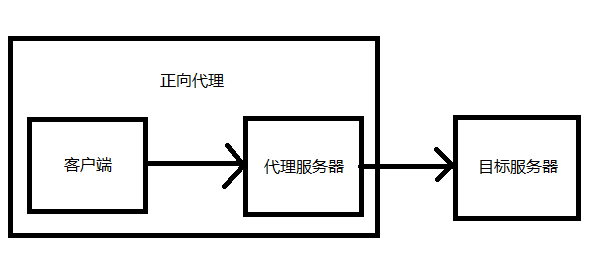
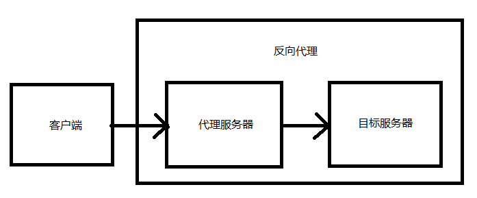

# 正向代理和反向代理

## 什么是网络代理

网络代理是一个应用程序，用于代替某人或某设备在网络中的角色。常见的代理有：vpn，游戏加速器等

代理可以分为两种形式：`正向代理` 和 `反向代理`

## 正向代理

正向代理是一个用于代理客户端的应用程序，如图：

正向代理将代替客户端与目标服务器进行通信，然后将通信的结果返回给客户端

正向代理的特点是，目标服务器无法感知真实用户的存在

## 反向代理

反向代理是一个用于代理目标服务器的应用程序，如图：

反向代理将代替服务器与客户端进行通信，然后将客户端的请求，发送给目标服务器，目标服务器做出响应后将结果发送给代理，代理服务器再将结果作为请求结果响应给客户端

反向代理的特点是，客户端无法感知代理服务器后面的目标服务器
