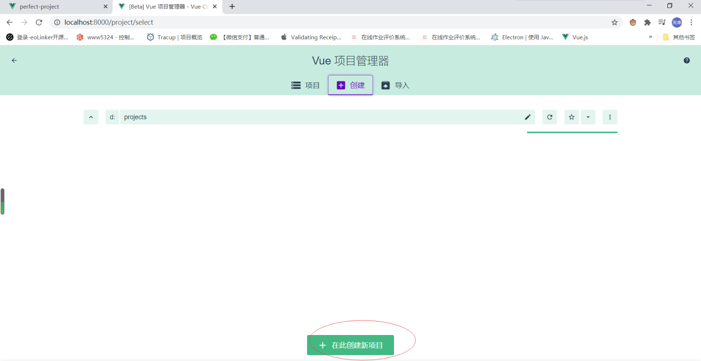
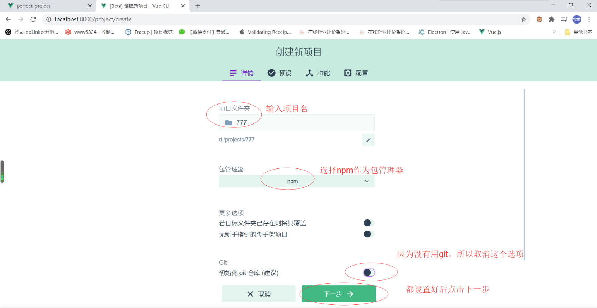
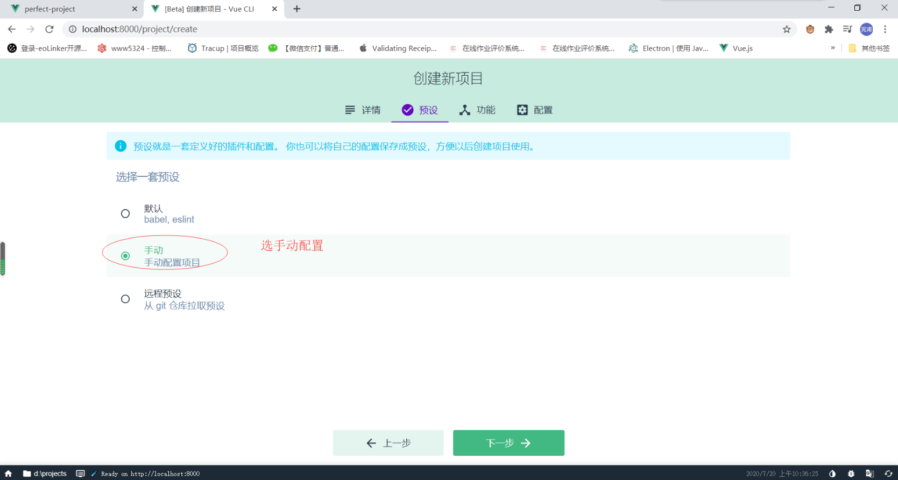
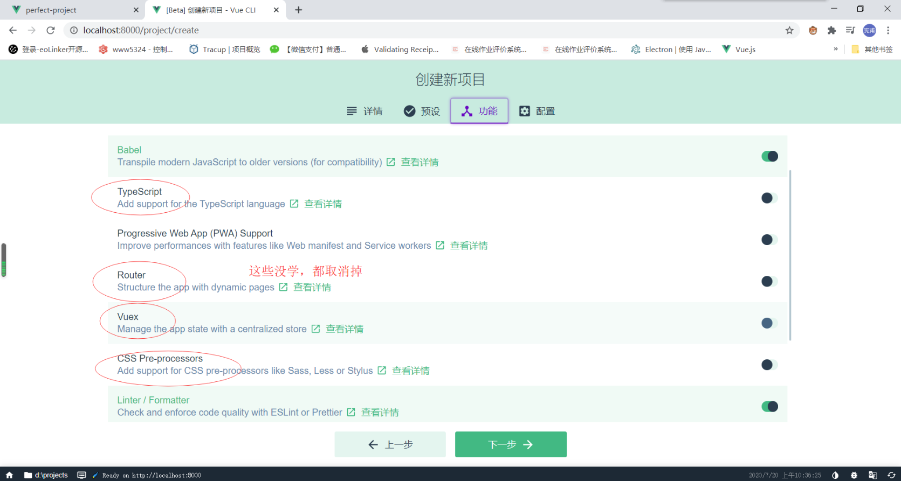
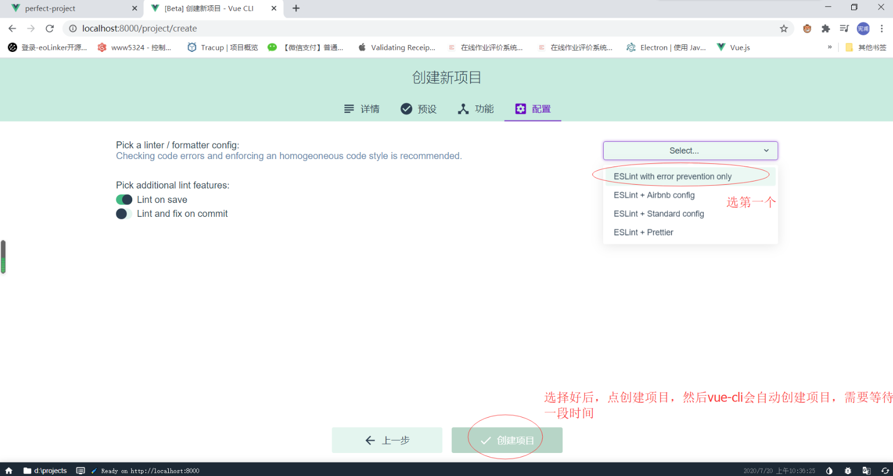

## vue-cli 命令行工具
官网：https://cli.vuejs.org/zh/

vue-cli 命令行工具主要用于创建vue项目

#### 安装
```shell script
npm install -g @vue/cli
# OR
yarn global add @vue/cli
```

#### 通过命令创建项目
```shell script
vue create project-name
```

#### 通过命令行启动创建项目引导
```shell script
vue ui
```

创建一个空项目演示如下：
- 选择一个将要创建项目的文件夹，点击在此创建项目

- 设置项目名、包管理工具、git等，点击下一步继续

- 预设选择手动配置

- 取消掉多余的工具

- 选择一个eslint工具，点击创建项目

