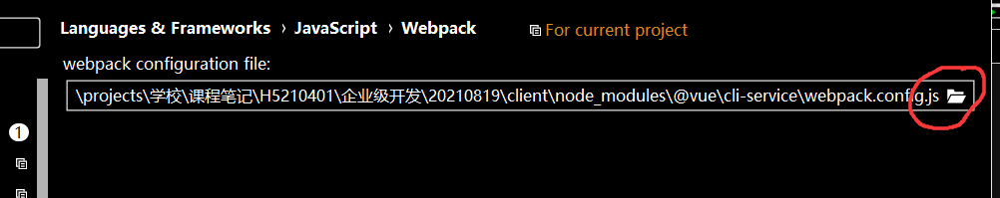

# vue-cli资源路径
通过 vue-cli 命令行工具创建的项目，可以使用以下几个符号作为资源路径的开头使用

```
.   文件系统相对路径
~   指定模块路径
@   项目src路径
```

## 让webstorm 识别 @ 的方法
参考：https://juejin.cn/post/6844903802185891848

- 打开 setting
- 搜索 webpack
- 点击以下按钮找到以下文件 `<项目文件夹>/node_modules/@vue/cli-service/webpack.config.js`

- 最后点击确定即可

> 上述方法配置 @ 符号的前提是我们的项目是使用 vue-cli 命令行工具创建的
