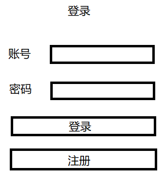
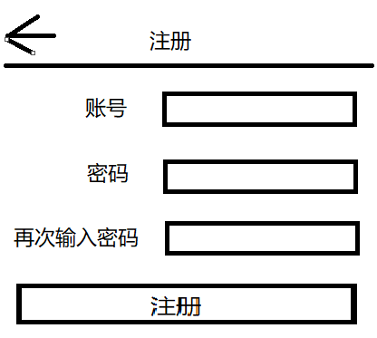

# 要求

使用 ant-design-vue 制作登录注册页

具体要求

- 登录页作为首页
- 登录页点击注册按钮跳转到注册页
- 注册页的页头上，点击返回按钮返回登录页
- 账号长度为6~10位
- 账号需要是字母或数字构成
- 密码长度为6~10位
- 密码需要是下划线字母数字构成
- 密码需要二次验证
- 账号注册后将数据保存到vuex中，然后跳转到登录页
- 登录页输入账号密码，点击登录后和vuex中存储的数据进行对比校验
