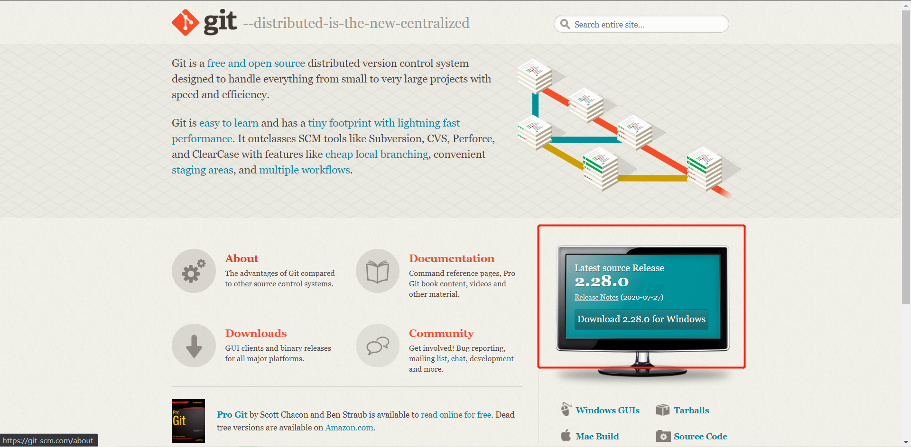

# 简介和安装git

## 简介

VCS（version control system）：版本控制系统

- 分布式版本控制系统：
  - git
  - plastic scm 一个企业级可视化分布式版本控制系统
- 集中式版本控制系统：
  - svn

git分布式版本控制系统，由于分布式的原因（去中心化，不需要服务器），需要弄清楚本地仓库和远程仓库的概念

- 本地仓库：所有版本存在本地电脑
- 远程仓库：远程服务器上的版本

由于有本地和远程的差异，所以需要同步版本，要用到以下命令

- clone：克隆远程代码
- pull：拉取
- push：推送

## 作用

多人协作开发时用于代码管理

## 安装

通过官网：```https://git-scm.com/```下载git客户端



安装完后输入```git --version```验证git是否安装成功，安装成功的话会返回类似结果：

```shell script
git version 2.27.0.windows.1
```

## 线上git仓库

- github: <https://github.com/>
- gitee(码云): <https://gitee.com/>

## 私库

- GitLab: <https://about.gitlab.com/>
- Gogs: <https://gogs.io/>
