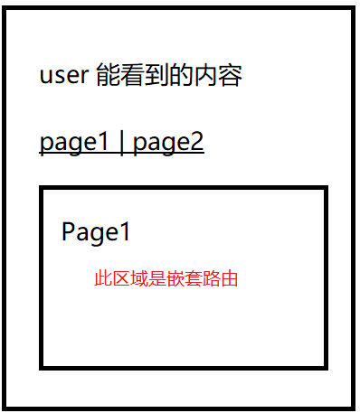

# 要求

使用 vue-router 完成以下内容

1. 创建一个登录页
    - 登录页录入账号
    - 设计两个账号，一个叫 user 另一个叫 admin
    - 登录成功后进入首页
2. 创建首页
    - 首页中根据登录账号不同，显示不同的内容
    - 若是 user 登录的，则显示按钮 page1 page2 分别对应跳转到页面 Page1 Page2(注意 Page1 Page2 使用嵌套路由显示)
    
    - 若是 admin 登录的，则能看到 page2 page3 分别对应跳转到页面 Page2 Page3
    - 首页包含退出按钮，退出后可以重新登录

> 注意: 若使用 user 登录，则不能通过访问 url 直接访问页面 page3