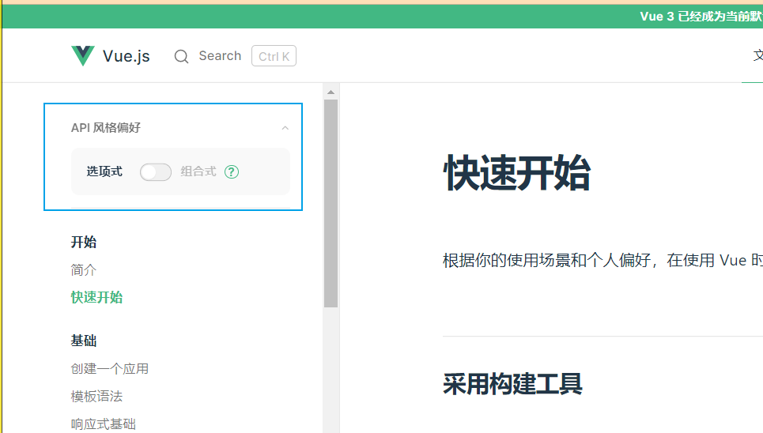
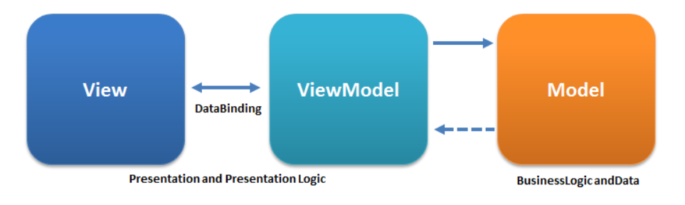

# vue简介

官网: <https://staging-cn.vuejs.org/>

vue（读音类似view）是一个 **响应式** 的 **核心** 的js库

- 响应式：数据变化立即自动更新视图
- 核心的js库
  - 一切前端代码都是基于该核心完成的，类似于大楼的地基、汽车的底盘。
  - 基于核心能够衍生出很多生态。

## 如何查看文档？

文档有 vue2 和 vue3 版本，现在已 vue3 版本为主介绍

vue3 存在两个版本的文档，如图

选项式: 类似于 React 的类组件

组合式: 类似于 React 的函数组件

## 兼容性

Vue 不支持 IE8 及以下版本，因为 Vue 使用了 IE8 无法模拟的 ECMAScript 5 特性。但它支持所有兼容 ECMAScript 5 的浏览器。

## 响应式设计原理

受MVVM设计模式启发，并不完全遵照MVVM设计模式的设计

MVVM设计如下：

vue的响应式设计如下：

图中有几个重要概念：

- virtual dom tree：这是vue在内存中的一个虚拟dom对象，如果数据发生变化，vue会先更新虚拟dom，然后对比虚拟dom和真实dom的差别，将有区别的地方做更新
- Data的setter和getter：这是赋值与取值的访问器，本质上是两个方法，用于修改赋值和取值行为
- watcher：监视者，当数据data的setter方法被调用时会通知它
