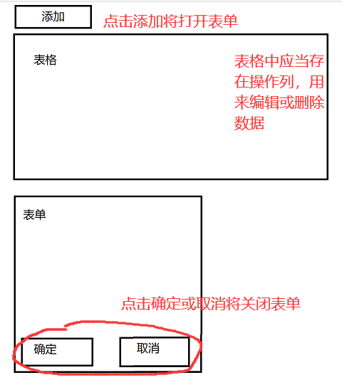

# 要求
- 使用 vue 完成页面
- 在页面中创建一个表格用于显示数据，创建一个表单用于添加和编辑数据
- 表单在点击添加按钮和编辑按钮时将被显示
- 当点击确定或取消就关闭表单
- 数据类型如下：
```js
let book = {
    id: 0,
    name: '书名',
    author: '作者',
    sex: '性别',
    country: '国家', // select
    desc: '简介' // textarea
}
```

效果图如下：

