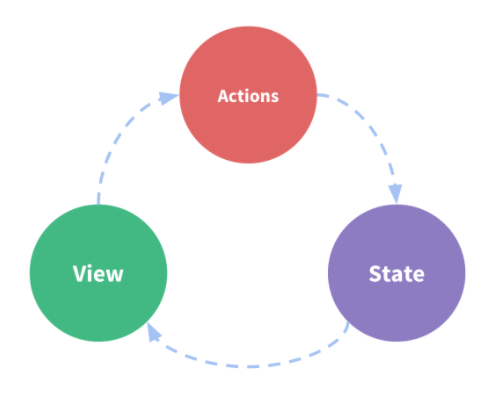
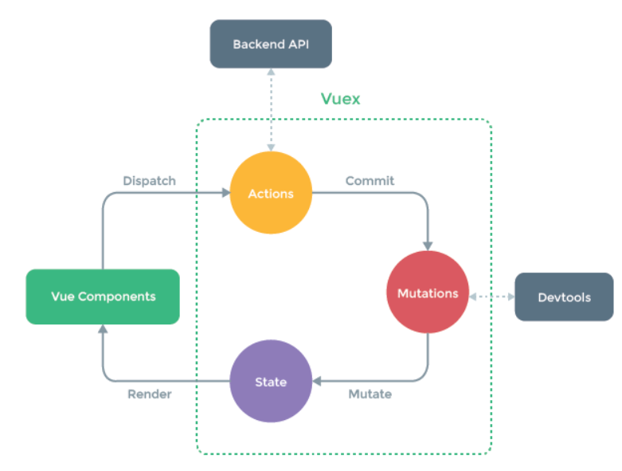

# vuex简介和安装

官网：<https://vuex.vuejs.org/zh/>

Vuex 是一个专为 Vue.js 应用程序开发的状态管理模式。它采用集中式存储管理应用的所有组件的状态，并以相应的规则保证状态以一种可预测的方式发生变化

关键字：

- 状态管理模式：vuex 的作用是拿来管理应用状态
- 集中式存储：状态可以在组件间共享
- 相应的规则：vuex 的状态树是一个单向数据流
  
单向数据流是什么？

单向数据流概念图：

- 状态，驱动应用的数据源；
- 视图，以声明方式将状态映射到视图；
- 操作，响应在视图上的用户输入导致的状态变化。



vuex 的运作原理图：

- vue components：页面组件
- actions：操作，vuex 提供的由页面触发的操作，actions 可以是异步的，往往在这里可以向服务器发起请求，获取数据
- mutations：修改状态的函数，在严格模式下，状态只能由 mutations 修改，且 mutations 必须是同步函数
- state: 应用程序共享的状态，状态变化将触发页面更新



## vuex 的应用场景

应用程序中用于共享数据给所有组件，并将数据进行一个集中化管理

## 安装

```shell
npm i vuex@next
```
