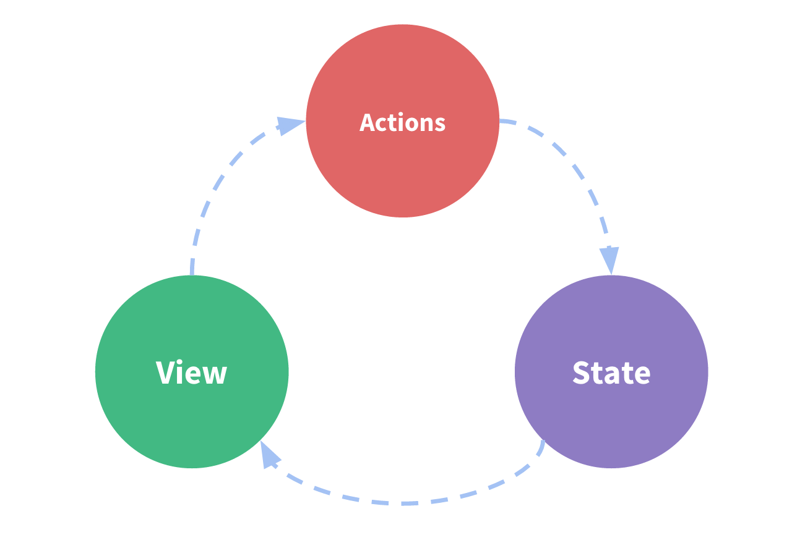
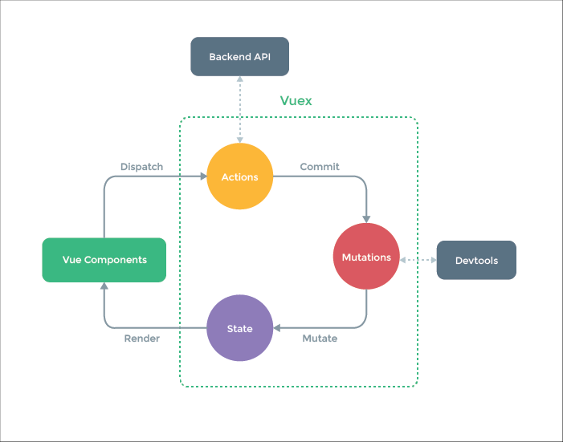

## Vuex介绍与安装
#### 什么是vuex？
Vuex 是一个专为 Vue.js 应用程序开发的状态管理模式。它采用集中式存储管理应用的所有组件的状态，并以相应的规则保证状态以一种可预测的方式发生变化

#### 有什么用？
什么是“状态管理模式”？

让我们从一个简单的 Vue 计数应用开始：
```js
new Vue({
  // state
  data () {
    return {
      count: 0
    }
  },
  // view
  template: `
    <div>{{ count }}</div>
  `,
  // actions
  methods: {
    increment () {
      this.count++
    }
  }
})
```
这个状态自管理应用包含以下几个部分：
- state，驱动应用的数据源；
- view，以声明方式将 state 映射到视图；
- actions，响应在 view 上的用户输入导致的状态变化。

以下是一个表示“单向数据流”理念的简单示意：


但是，当我们的应用遇到多个组件共享状态时，单向数据流的简洁性很容易被破坏：

- 多个视图依赖于同一状态。
- 来自不同视图的行为需要变更同一状态。

vuex就是用来解决这些问题的，概念图如下：


所以vuex的作用总结起来如下：
- 维护单向数据流
- 使多页面之间共享数据
