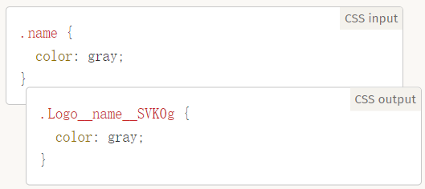

## 简介
官方中文文档：https://github.com/postcss/postcss/blob/master/README-cn.md

是一个用 JavaScript 工具和插件转换 CSS 代码的工具

作用：类比babel是转换js的翻译，postcss就是转换css的翻译（postcss不止做了翻译）。主要作用就是提高css在各浏览器上的兼容性

#### 特性
- 自动添加前缀Autoprefixer插件
    
- PostCSS Preset Env 帮你将最新的 CSS 语法转换成大多数浏览器都能理解的语法，并根据你的目标浏览器或运行时环境来确定你需要的 polyfills，此功能基于 cssdb 实现
    
- 终结全局 CSS
    
- stylelint 代码验证
    
