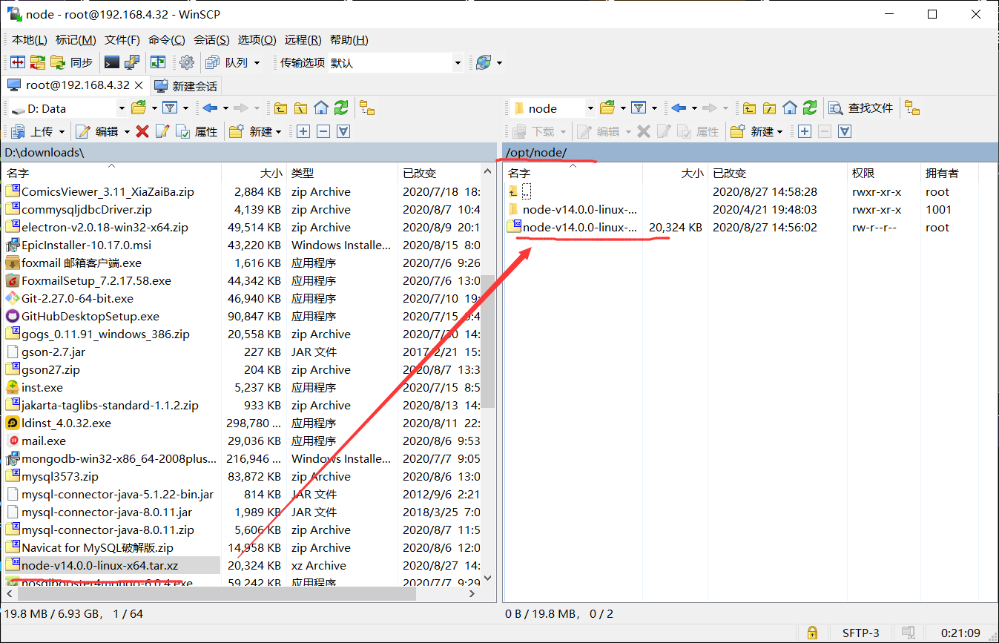

## 安装node.js
在centos7下 使用 ```uname -a``` 命令查看对应cpu版本，在官网上下载 node.js

下载文件如：node-v14.0.0-linux-x64.tar.xz

将下载好的文件通过winscp放入虚拟机



打开 putty 进入 node-v14.0.0-linux-x64.tar.xz 文件所在目录，执行以下命令解压：
```shell script
tar -xvf node-v14.0.0-linux-x64.tar.xz
```

解压完成后，给解压后的bin目录中的node、npm、npx建立软连接
```shell script
ln -s /opt/node/node-v14.0.0-linux-x64/bin/node /usr/local/bin/
ln -s /opt/node/node-v14.0.0-linux-x64/bin/npm /usr/local/bin/
ln -s /opt/node/node-v14.0.0-linux-x64/bin/npx /usr/local/bin/
```

最后验证node.js
```shell script
node -v
# 输出 ===> v14.0.0
```

### 使用包管理器yum进行安装
在网络允许的情况下，可以使用 centos 系统的软件包管理工具进行安装，方法如下：

```
# 更新包管理工具
yum update
# 给系统添加NodeSource代码仓库的地址，其中 setup_10.x 可以根据版本号换成 setup_14.x 或更高版本
curl –sL https://rpm.nodesource.com/setup_10.x | sudo bash -
# 安装 nodejs
yum install –y nodejs
```
