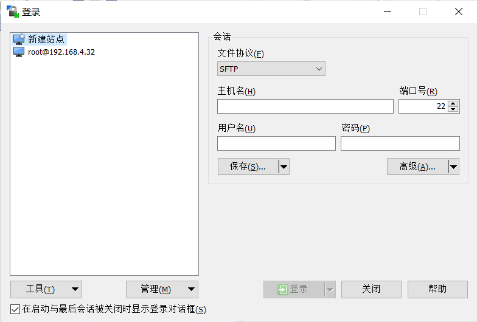
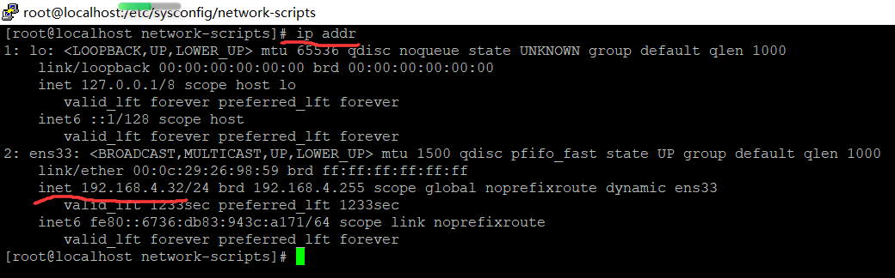
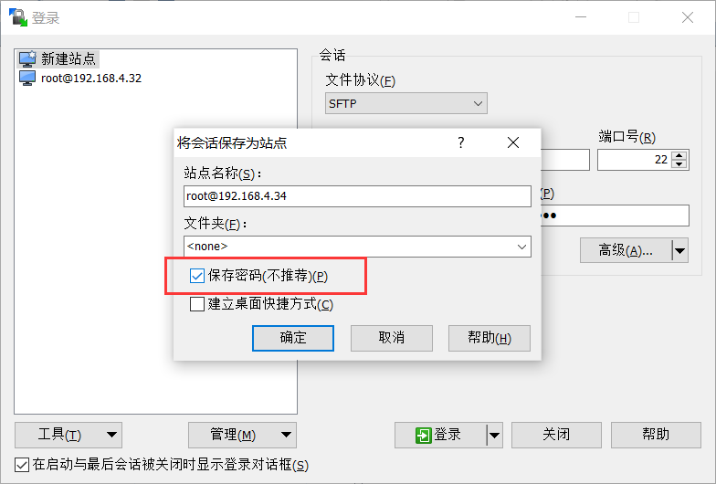
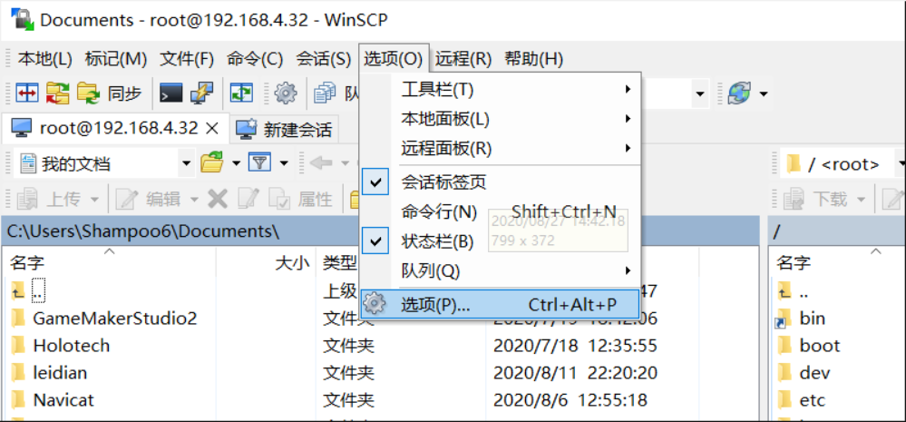
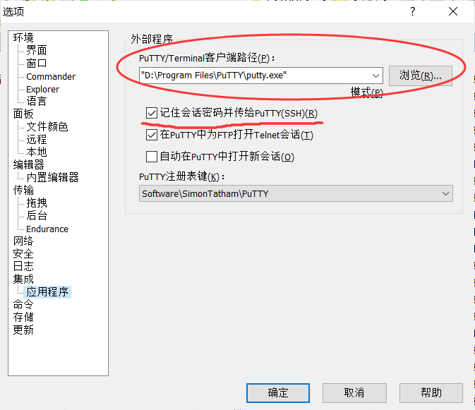

## 安装winscp putty
先安装winscp和putty

#### winscp会话配置
打开winscp



这里需要输入ip地址、用户名和密码

用户名就是root 密码是安装centos7时自己设置的

ip地址需要在centos7中输入
```shell script
ip addr
```
来查看ip地址，如图：



保存并记录密码



#### putty配置
进入会话后，打开选项：



选择 putty 路径，并勾选保存密码选项


