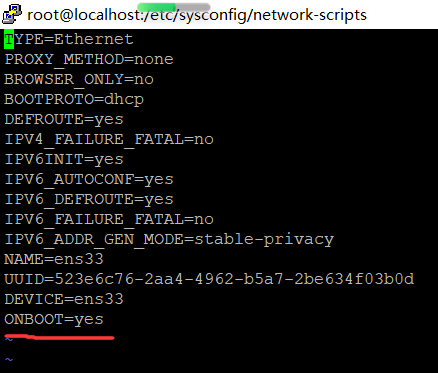

## 安装虚拟机环境
下载 VMware12，并执行安装

下载 centos7 系统镜像

通过VMware创建虚拟机，安装centos7

#### 网络配置
VMware中使用 桥接模式

然后在centos7中使用命令
```
vi /etc/sysconfig/network-scripts/ifcfg-ens33
```
将ONBOOT改成yes



然后重启虚拟机或重开网络服务
```shell script
reboot
# or
service network restart
```
